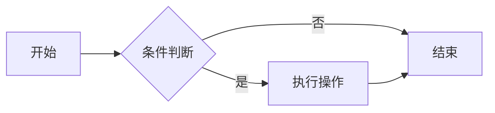

# 代码块与高亮

## 基础代码块

使用三个反引号包裹代码，并指定语言以启用语法高亮：

````markdown
```python
def fibonacci(n):
    a, b = 0, 1
    for _ in range(n):
        a, b = b, a + b
    return a
```
````

效果：

```python
def fibonacci(n):
    a, b = 0, 1
    for _ in range(n):
        a, b = b, a + b
    return a
```

## 代码高亮 + 行号

```yaml
markdown_extensions:
  - pymdownx.highlight:
      anchor_linenums: true
```

## 代码标注

在代码块中使用 `# (1)` 标注，下方会自动生成注释列表：

```python
def greet(name):  # (1)
    print(f"Hello, {name}!")  # (2)
```

1. 定义函数，接收 `name` 参数
2. 打印问候语

## 可复制代码

配置 `content.code.copy` 后，每个代码块右上角会出现复制按钮（本站已启用）。

## 标签页代码

使用 `tabbed` 扩展可以在多个代码之间切换：

````markdown
=== "Python"

    ```python
    print("Hello")
    ```

=== "JavaScript"

    ```javascript
    console.log("Hello");
    ```
````

效果：

=== "Python"

    ```python
    print("Hello")
    ```

=== "JavaScript"

    ```javascript
    console.log("Hello");
    ```

## Mermaid 图表


